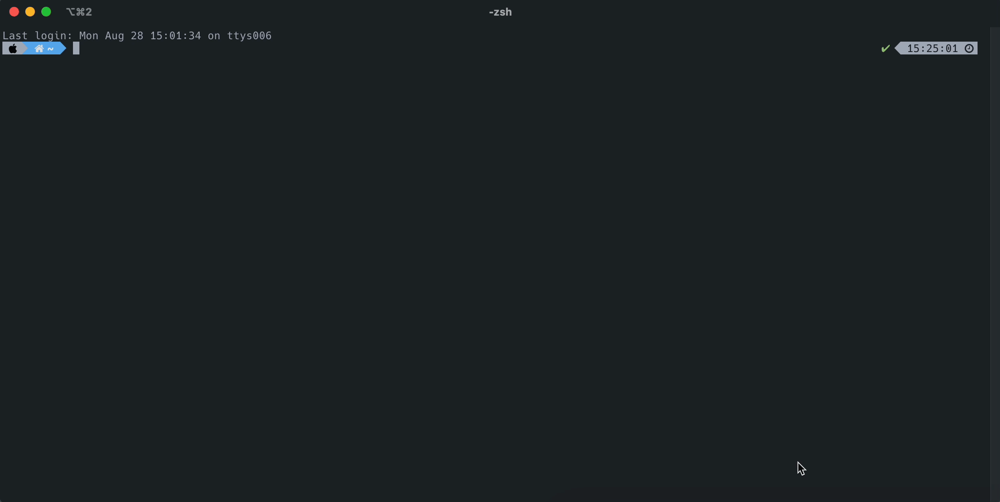

# GPTCLI
`gptcli` is a CLI application using [ChatGPT API](https://openai.com/blog/introducing-chatgpt-and-whisper-apis).
Now you can run ChatGPT inside your terminal with user-friendly interface!

---

### Table of Contents
- [Showcase](#showcase)
- [Installation](#installation)
- [Usage](#usage)

---

### Showcase



### Installation
```bash
git clone git@github.com:3seoksw/gptcli.git
```

After installing, there are few more steps to do in order to run the program easily.<br>

- Set ChatGPT API key
    - Visit [ChatGPT API keys](https://platform.openai.com/account/api-keys) then log in.
    - Click `+ Create new secret key` and generate one. (You may need to pay for a small fee for using API)
    - After getting the key, add the following to your `~/.zshrc` or `~/bashrc`
        ```bash
        export OPENAI_API_KEY="YOUR-API-KEY"
        ```
- Set the alias
    ```bash
    alias gptcli="python $HOME/DIRECTORY-YOU'VE-INSTALLED"
    ```

### Usage
By typing the following, you can start the app.
```
gptcli
```
```
--preset, -p PRESET     Set a preset with the option of:
                        "Q&A", ...
                        default: "Q&A"
--new_chat, -n BOOLEAN  Start a new chat if set
                        default: False
--api_key, -a           Set an API key for ChatGPT
```

### TODOs
- [ ] Preset
- [x] New Chat
- [x] API Key
- [ ] Help
- [ ] Temperature
